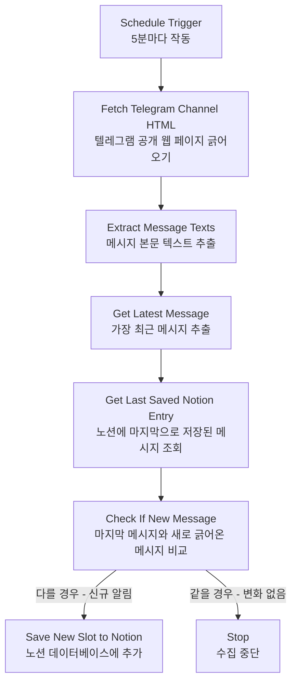

# 미국 비자 슬롯 모니터링 가이드 (텔레그램 우회 스크래핑 방식)

이 가이드는 비자 사이트 차단 및 계정 정지 위험을 우회하기 위해, **텔레그램의 공개 비자 알림방 웹페이지**를 감시하는 n8n 워크플로우(`US Visa Slot Monitor via Telegram`)의 동작 원리와 설정 방법입니다.

---

## 1. 작동 방식 (How it works)

1. **보안성 100%:** 미국 비자 예약 페이지에 본인 계정이나 IP가 직접 접속하지 않고, 누군가 공개 텔레그램방에 배포한 정보글을 텔레그램 공식 웹뷰(`https://t.me/s/채널ID`)로 안전하게 긁어옵니다.
2. **중복 알림 방지:** 마지막으로 수집된 노션 페이지와 새로 긁어온 텔레그램 최신 메시지를 비교하여, **내용이 다를 때만** 노션에 등록하므로 표가 중복 데이터로 더러워지지 않습니다.

---

## 2. 텔레그램 채널 변경 방법

기본값으로 해외의 공개 비자 모니터링 채널(`us_visa_slots`)이 지정되어 있습니다. 사용자님이 가입하고 싶으신 한국 내 대사관 알림방 채널로 자유롭게 변경할 수 있습니다.

1. `http://192.168.0.11:5678`에 접속하여 로그인합니다.
2. **`US Visa Slot Monitor via Telegram`** 워크플로우를 엽니다.
3. **`Fetch Telegram Channel HTML`** 노드를 더블클릭합니다.
4. **URL** 필드의 맨 뒤 채널 ID를 원하는 채널로 변경합니다.
   * 예: `https://t.me/s/원하는_공개_채널_ID` (웹 브라우저로 들어갔을 때 메시지 피드가 보이는 공개 채널이어야 합니다.)
5. 마지막 **`Save New Slot to Notion`** 노드를 더블클릭하여, **URL** 속성의 텔레그램 채널 주소를 동일하게 수정해 줍니다. (노션에서 쉽게 텔레그램방으로 넘어가기 위함입니다.)
6. 워크플로우 우측 상단의 **`Active`** 스위치를 켭니다.
